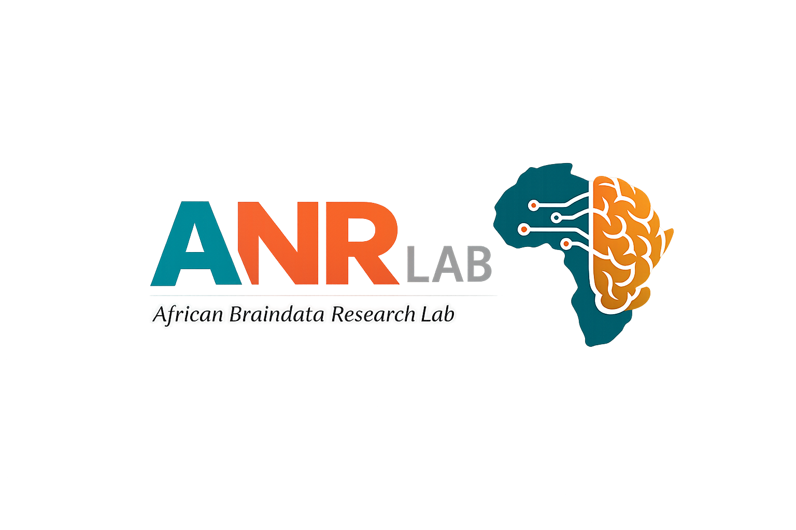

<p align="center">
  
</p>

<h1 align="center">ANR Lab Mendi fNIRS Recorder</h1>

<p align="center">
  Browser-based Mendi fNIRS research acquisition, protocol timing, event marking, raw optical monitoring, IMU monitoring, and structured local export.
</p>

<p align="center">
  <a href="https://african-neurodata-research-lab-anr-lab.github.io/ANR-Lab-Mendi-Recorder/"><strong>Launch Recorder</strong></a>
  ·
  <a href="docs/RECORDING_GUIDE.md">Recording Guide</a>
  ·
  <a href="docs/EXPORT_FORMAT.md">Export Format</a>
  ·
  <a href="docs/VALIDATION_STATUS.md">Validation Status</a>
  ·
  <a href="https://africanneurodataresearch.org/">ANR Website</a>
</p>

<p align="center">
  <a href="https://github.com/African-Neurodata-Research-Lab-ANR-LAB/ANR-Lab-Mendi-Recorder/actions/workflows/deploy-pages.yml">
    
  </a>
  <a href="LICENSE">
    
  </a>
  
  
  
  
</p>

---

## Overview

**ANR Lab Mendi fNIRS Recorder** is a browser-based research acquisition tool developed by the **African NeuroData Research Lab (ANR Lab)** for working with Mendi fNIRS hardware through Web Bluetooth.

The recorder keeps acquisition transparent: it preserves raw BLE packets, decodes only mapped fields, displays technical acquisition information, manages experimental protocol timing, logs research events, and exports the session locally in the browser.

The recorder is intentionally separated from scientific interpretation. It does **not** currently calculate HbO, HbR, brain activation, cognitive state, diagnosis, or clinical conclusions.

> **Research-use notice:** This software is an experimental research acquisition tool. It is not a medical device and is not intended for diagnosis, treatment, or clinical decision-making.

## Features

- Direct Mendi connection through **Web Bluetooth**
- Validated Mendi V4 GATT characteristic discovery
- Raw BLE packet capture with timestamps
- ABB1 frame decoding
- Raw left/right Red, IR/NIR, and Ambient optical fields
- Pulse/reference optical fields when present
- Mendi sensor temperature display
- Raw accelerometer and gyroscope monitoring
- ABB4 battery-voltage telemetry
- Protocol builder with Baseline, Task, Rest, Get Ready, and Custom phases
- Phase-boundary event markers
- Manual and optional repeated automatic markers
- Session and protocol clocks
- Disconnect/reconnect recovery
- Local metadata, raw packet, decoded signal, and event export
- No automatic participant-data upload

## Live Application

**[Launch the ANR Lab Mendi fNIRS Recorder](https://african-neurodata-research-lab-anr-lab.github.io/ANR-Lab-Mendi-Recorder/)**

> GitHub Pages deploys from `main`. Development changes may be validated on another branch before public release.

## Requirements

### Browser
Use Google Chrome or Microsoft Edge.

### Hardware
- Bluetooth-enabled computer
- Compatible Mendi fNIRS device
- Stable power for longer sessions
- Research protocol approved for the intended study

## Recording Workflow

1. **Open the recorder**
   - Launch the hosted application or start it locally.

2. **Enter pseudonymous session information**
   - Example participant: `ANR_001`
   - Example session: `SES_001`
   - Do not enter direct identifiers.

3. **Build the protocol**
   - Add phases.
   - Select phase type.
   - Set durations.
   - Configure AutoMarkers.
   - Set repeat count.

4. **Prepare the session**
   - Click **Prepare Session**.
   - Review the full protocol before continuing.

5. **Connect the Mendi**
   - Click **Connect Mendi**.
   - Choose the correct device in the Bluetooth picker.
   - Confirm the dashboard reports connected.

6. **Start acquisition**
   - Click **Start Session**.
   - The session clock, protocol clock, and first phase begin.

7. **Perform a freshness check**
   - Watch **Decoded Frames**.
   - Move the headset and confirm raw IMU values change.
   - Change optical contact and confirm Red/IR values change.
   - A rising frame count alone does not prove fresh data.

8. **Monitor the session**
   - Review raw optical values, temperature, battery, IMU, packet counts, and phase timing.

9. **Add research markers**
   - Use **+ Add Marker** when needed.
   - Phase boundaries are marked automatically.

10. **Handle disconnects**
    - Do not reload the page.
    - Reconnect the same Mendi or end the session.

11. **End the session**
    - Click **End Session**.
    - Final system markers and export are generated.

12. **Verify the export**
    - Confirm the manifest downloaded.
    - Confirm expected events and data counts are present.

See **[Recording Guide](docs/RECORDING_GUIDE.md)** for the detailed procedure.

## Understanding the Signal

The live plots currently display **raw optical device values**, not HbO/HbR concentration.

Displayed optical channels include:
- Red
- IR/NIR
- Ambient

fNIRS should not look like EEG. EEG can vary rapidly over milliseconds; haemodynamic fNIRS responses are slower and are interpreted over seconds.

This project will not label raw optical signals as HbO or HbR until wavelength mapping, optical path assumptions, extinction coefficients, and the conversion pipeline are validated.

### Current important limitation

On tested hardware, the browser fallback can return repeated ABB1 frames containing identical optical and IMU values. A rising decoded-frame count therefore does not automatically prove fresh sensor data.

See **[Validation Status](docs/VALIDATION_STATUS.md)**.

## Protocol and Event Markers

Example event sequence:

```text
0.000s | START_RECORDING
0.000s | BASELINE_START
30.000s | BASELINE_END
30.000s | TASK_START
90.000s | TASK_END
90.250s | SESSION_END
90.251s | STOP_RECORDING
```

Manual markers and repeated AutoMarkers can also be recorded.

## Export

A completed session currently downloads a manifest JSON file such as:

```text
SES_010_manifest.json
```

The manifest contains:
- recorder metadata
- pseudonymous session metadata
- protocol definition
- acquisition counts
- privacy metadata
- SNIRF availability status
- raw packet CSV text
- decoded optical/IMU CSV text
- event TSV text

See **[Export Format](docs/EXPORT_FORMAT.md)**.

## Scientific Boundary

| Data / Feature | Current status |
| --- | --- |
| Raw BLE packets | Supported |
| ABB1 parsing | Validated |
| Raw Red/IR/Ambient | Decoded |
| Mendi sensor temperature | Decoded |
| Raw accelerometer/gyroscope | Decoded |
| ABB4 battery voltage | Decoded |
| Protocol/event markers | Supported |
| HbO / HbR | Not implemented |
| Optical density | Not implemented |
| Modified Beer-Lambert conversion | Not implemented |
| Motion correction | Not implemented |
| SNIRF export | Disabled pending required metadata |
| Brain activation inference | Not supported |
| Clinical interpretation | Not supported |

## Physical Hardware Validation

Validated on physical Mendi hardware:
- Web Bluetooth selection
- GATT connection
- ABB1 through ABB6 discovery
- raw packet capture
- ABB1 field decoding
- sensor temperature decoding
- raw optical field decoding
- raw IMU field decoding
- ABB4 battery voltage decoding
- protocol timing and event export

The current highest-priority issue is **continuous fresh ABB1 streaming in the browser**. Current fallback reads can repeat a cached frame.

Until freshness is solved, flat live traces must be treated as an acquisition issue, not a biological result.

## Local Development

```bash
git clone https://github.com/African-Neurodata-Research-Lab-ANR-LAB/ANR-Lab-Mendi-Recorder.git
cd ANR-Lab-Mendi-Recorder
npm install
npm run dev
```

Run tests:

```bash
npm test -- --run
```

Build:

```bash
npm run build
```

Preview:

```bash
npm run preview
```

## Repository Structure

```text
ANR-Lab-Mendi-Recorder/
|-- .github/             GitHub workflows
|-- docs/                Research and technical documentation
|-- public/              Static assets and ANR logo
|-- src/
|   |-- app/             Controller and acquisition lifecycle
|   |-- ble/             Web Bluetooth and Mendi GATT
|   |-- export/          CSV, TSV, metadata, recovery, SNIRF guards
|   |-- markers/         Protocol and event marker engine
|   |-- protocol/        Decoders and optical extraction
|   |-- recording/       Session clocks and raw stores
|   |-- ui/              Recorder interface and styles
|   `-- visualization/   Dashboard and live traces
|-- tests/               Automated regression tests
|-- index.html
|-- package.json
`-- vite.config.js
```

## Privacy

- Use pseudonymous participant/session codes.
- Do not enter direct identifiers.
- Bluetooth MAC addresses are not exported.
- Browser opaque device IDs are not exported.
- Recordings are handled locally unless the researcher manually moves them elsewhere.
- The application does not automatically upload data to ANR Lab.

Researchers remain responsible for consent, ethics approval, secure storage, and institutional data-governance requirements.

## Troubleshooting

### Mendi connects but graph is flat
If frame count rises but optical and IMU values remain identical, treat the stream as stale/cached.

### Decoded Frames stays at 0
Check device selection, Bluetooth permission, ABB1 discovery, and that the session was prepared before starting.

### Why no HbO/HbR?
That is intentional. Scientific optical conversion is not yet validated.

### Why no SNIRF?
SNIRF remains disabled until the required scientific metadata and optical mapping are validated.

## Documentation

- [Recording Guide](docs/RECORDING_GUIDE.md)
- [Export Format](docs/EXPORT_FORMAT.md)
- [Validation Status](docs/VALIDATION_STATUS.md)
- [Architecture](docs/architecture.md)
- [Mendi Protocol Notes](docs/mendi_protocol.md)
- [Data Mapping](docs/data_mapping.md)
- [Hardware Validation](docs/hardware-validation.md)
- [NIRS Pipeline](docs/nirs_pipeline.md)

## Citation

Citation metadata are provided in [`CITATION.cff`](CITATION.cff).

## License

MIT License. See [`LICENSE`](LICENSE).

## African NeuroData Research Lab

Website: [africanneurodataresearch.org](https://africanneurodataresearch.org/)

Email: [anrlab.ng@gmail.com](mailto:anrlab.ng@gmail.com)

---

<p align="center">
  Developed for transparent, reproducible African neurodata research.
</p>
